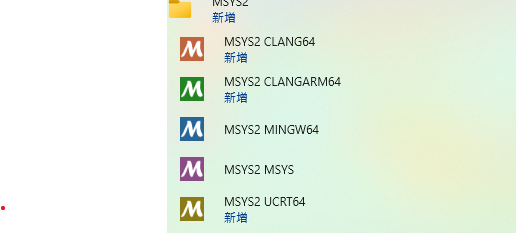

# A Collection of tools built on MSYS2
用 MinGW 在 Windows 上製作的工具程式

# Setup MinGW/MSYS2  
## Install MinGW/MSYS2
[MSYS2](https://www.msys2.org/)  
download msys2-x86_64-20250830.exe, and install  
預設安裝在 C:\msys64 

## MinGW/MSYS2 的選單
執行時使用 MSYS2 MINGW64  


## MSYS2 的環境 "MSYS2 MINGW64"
| Shell         | GCC              |                                   |
|---------------|------------------|-----------------------------------|
| MSYS shell    | usr/bin/gcc      | Cygwin-like，不含 MinGW64 library |
| MINGW64 shell | /mingw64/bin/gcc | 原生 Windows exe，能連 hidapi      |
| UCRT64 shell  | /ucrt64/bin/gcc  | 新 runtime                        |
需要選擇 "/mingw64/bin/gcc" 但是他環境是有問題的. 需自行確認 GCC

## 確認 MINGW64 的 Toolchain
Toolchain 有時會沒有安裝 (\mingw64/bin 下面沒有執行檔), 需自行安裝
安裝時如果有錯誤 ( connection timed out), 可以重新執行 
```
$ pacman -S mingw-w64-x86_64-toolchain
```
## 確認 gcc 版本
```
$ which gcc
/mingw64/bin/gcc 正確
/usr/bin/gcc     錯誤
```

## 更新套件資料庫
pacman -Sy

## 安裝 make, gcc
pacman -S make
pacman -S base-devel gcc

## 測試安裝
make --version
gcc --version

## 安裝 pkg-config
```
pacman -S mingw-w64-x86_64-pkg-config
```


